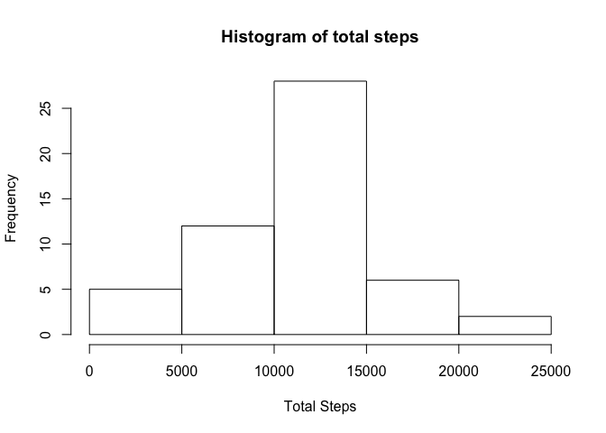
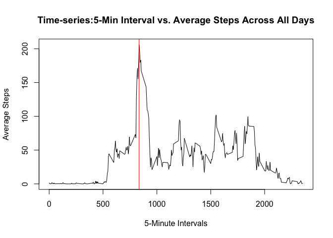
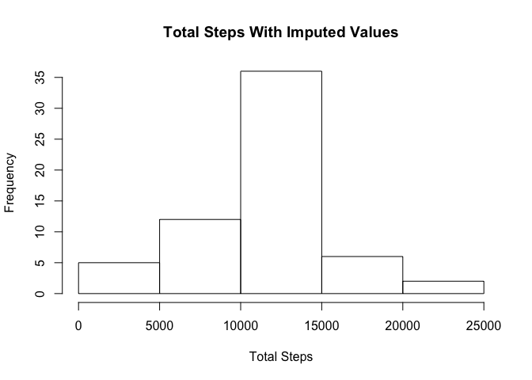
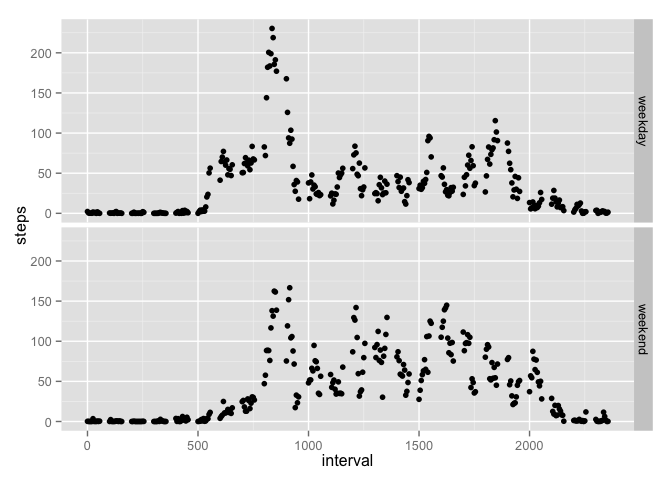

# Reproducible Research: Peer Assessment 1


## Loading and preprocessing the data

The data needed for this assignment can be downloaded from the [Github](https://github.com/kalleigh/RepData_PeerAssessment1/blob/master/activity.zip) page.

Once data is downloaded into your working directory, you use the following code to read it into R. I used the zoo package to make it easy to work with dates to convert the character date field into a Date field. 


```r
library(zoo)
```

```
## 
## Attaching package: 'zoo'
## 
## The following objects are masked from 'package:base':
## 
##     as.Date, as.Date.numeric
```

```r
library(dplyr)
```

```
## 
## Attaching package: 'dplyr'
## 
## The following object is masked from 'package:stats':
## 
##     filter
## 
## The following objects are masked from 'package:base':
## 
##     intersect, setdiff, setequal, union
```

```r
library(ggplot2)
library(broman)
```


```r
activity<-read.csv("~/activity.csv")
activity$dateformat<-as.Date(activity$date)
activity<-select(activity, -date)
```

## What is mean total number of steps taken per day?

First, I started by removing the NA values from the main dataset. Then by using the group_by function, I grouped all date together to then take the total steps per day. 

```r
actcomp<-na.omit(activity)
dategroup<-group_by(actcomp, dateformat)
totalsteps<-summarise_each(dategroup, funs(sum))
meansteps<-myround(mean(totalsteps$steps), 2)
mediansteps<-median(totalsteps$steps)
```

Here is the histogram of the total number of steps taken each day: 


```r
hist(totalsteps$steps, main="Histogram of total steps", xlab="Total Steps")
```

 

The **mean** total steps taken per day is **10766.19.**

The **median** total steps taken per day is **10765.** 

## What is the average daily activity pattern?

Used the same logic of grouping, but this time by each 5-minute interval. 


```r
intgroup<-group_by(actcomp, interval)
dailyactivity<-summarise_each(intgroup, funs(mean))
maxinterval<-subset(dailyactivity, dailyactivity$steps==max(dailyactivity$steps))
int<-maxinterval[1]
```

Below is the Time-Series plot of the 5-min intervals and the average steps taken during that interval across all days:


```r
plot(dailyactivity$interval, dailyactivity$steps, type="l", main="Time-series:5-Min Interval vs. Average Steps Across All Days", xlab="5-Minute Intervals", ylab="Average Steps")
abline(v=maxinterval[1], col="red")
```

 

The **interval** that contains the maximum average steps across all days is **835.**

## Imputing missing values


```r
navalues<-activity[is.na(activity),]
length<-nrow(navalues)
```

The total number of missing values in the dataset are **2304.**

The imputing strategy I used is to substitute the missing values with the mean of the corresponding 5-min interval. By using the dailyactivity grouping that I had created for the previous queestion, I set the missing values for the newly extracted dataset that had just the NA values. Once the 5-minute intervals were extracted, I then used rbind to combine the two datasets together to create the new dataset called "newdataset"


```r
for(i in 1:2304){
  j<-navalues$interval[i]
  step<-dailyactivity$steps[dailyactivity$interval==j]
  navalues$steps[i]<-step
} 
newdataset<-rbind(actcomp, navalues)
newdataset<-arrange(newdataset, dateformat)
newdataset$steps<-as.numeric(newdataset$steps)
newdategroup<-group_by(newdataset, dateformat)
newtotalsteps<-summarise_each(newdategroup, funs(sum))
newmeansteps<-myround(mean(newtotalsteps$steps), 2)
newmediansteps<-myround(median(newtotalsteps$steps), 2)
```

This is the histogram of the Total Steps taken each day after imputing NA values:


```r
hist(newtotalsteps$steps, main="Total Steps With Imputed Values", xlab="Total Steps")
```

 

The **mean** total steps taken per day is **10766.19.**

The **median** total steps taken per day is **10766.19.** 

As a reminder, the mean total steps *without* NA values was 10766.19 and the median was 10765. 

As you can see, the mean of the new set of values do not differ from what we saw before. However, the median value changed to accommodate for the new values of mean of each 5-minute intervals that we newly imputed the system with.

## Are there differences in activity patterns between weekdays and weekends?

This question required the creation of two additional variables - one to identify the day of the week and then to calculate the factor variable for whether it was a weekday or a weekend day. 


```r
newdataset$dayweek<-weekdays(newdataset$dateformat)
j<-nrow(newdataset)
for(i in 1:j) {
  if(newdataset$dayweek[i]=="Saturday" || newdataset$dayweek[i]=="Sunday")
    newdataset$typeofday[i]="weekend"
    else
      newdataset$typeofday[i]="weekday"
}
```

I then created a grouping based on 2 variables - the factor as well as the 5-min interval, in order to calculate the average steps taken per 5-min interval across all days. Using the ggplot2 package, I then constructed the plot to compare weekday and weekend activity. 


```r
daygroup<-group_by(newdataset, typeofday, interval)
daygroup<-select(daygroup, -dayweek)
daytotals<-summarise_each(daygroup, funs(mean))
daytotals$typeofday<-as.factor(daytotals$typeofday)
g<-ggplot(daytotals, aes(x=interval, y=steps))
```

This plot shows side-by-side comparisons of daily average activity in 5 minute intervals on Weekdays and Weekends:


```r
g+geom_point(type="l")+facet_grid(typeofday~.)
```

 

